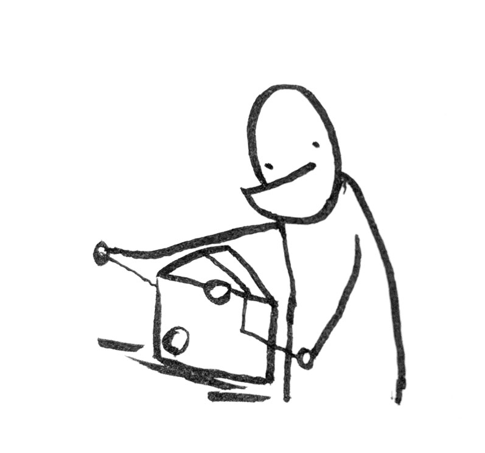

# CheeseWire



Lifecycle-friendly view binding in Kotlin for Conductor.

[](https://travis-ci.org/hannesstruss/cheesewire)
[](http://search.maven.org/#search%7Cga%7C1%7Ccheesewire)

To use, add a `ConductorViewBinder` to your base controller:

```kotlin
abstract class BaseController : Controller() {
  protected val views = ConductorViewBinder(this)
}
```

This can now be used to bind views in your concrete controllers:

```kotlin
class HomeController : BaseController() {
  private val btnLogin: Button by views.bind(R.id.btn_login)
}
```

during `onDestroyView`, the view binder is reset, and your views aren't leaked.

See the [sample app](https://github.com/hannesstruss/cheesewire/tree/master/sample) for an example.


## Generic lazy

CheeseWire view binders also provide a generic lazy property delegate which
is synchronized with your view property lifecycle. This comes in handy e.g. in
combination with [RxBinding](https://github.com/JakeWharton/RxBinding) when you
want to avoid calling the RxBinding methods twice on a view:

```kotlin
class MyMviController : BaseController() {
  private val btnLogin: Button by views.bind(R.id.btn_login)
  private val btnSignup: Button by views.bind(R.id.btn_login)

  val intentions by views.lazy {
    Observable.merge(
        btnLogin.clicks().map { Intention.Login },
        btnSignup.clicks().map { Intention.Signup }
    )
  }
}
```


## Download

```groovy
dependencies {
  implementation 'de.hannesstruss.cheesewire:cheesewire-conductor:0.2'
}
```


## Attributions :bow:

CheeseWire is inspired by the awesome work of [ButterKnife](http://jakewharton.github.io/butterknife/),
[KotterKnife](https://github.com/JakeWharton/kotterknife) and
[ButterknifeConductor](https://gist.github.com/EricKuck/05887d898c85ae4c47bf88b2cd127e71).


## License

    Copyright (C) 2017 Hannes Struss

    Licensed under the Apache License, Version 2.0 (the "License");
    you may not use this file except in compliance with the License.
    You may obtain a copy of the License at

       http://www.apache.org/licenses/LICENSE-2.0

    Unless required by applicable law or agreed to in writing, software
    distributed under the License is distributed on an "AS IS" BASIS,
    WITHOUT WARRANTIES OR CONDITIONS OF ANY KIND, either express or implied.
    See the License for the specific language governing permissions and
    limitations under the License.
